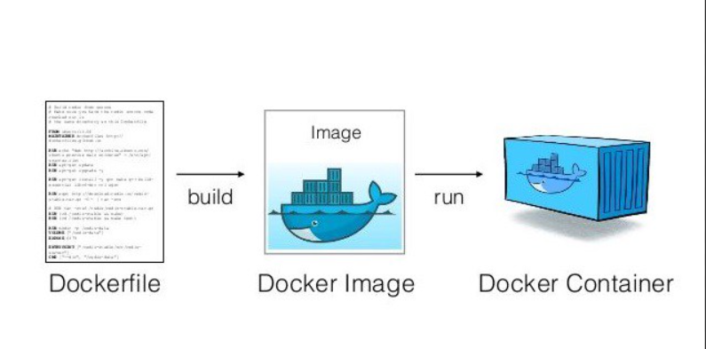
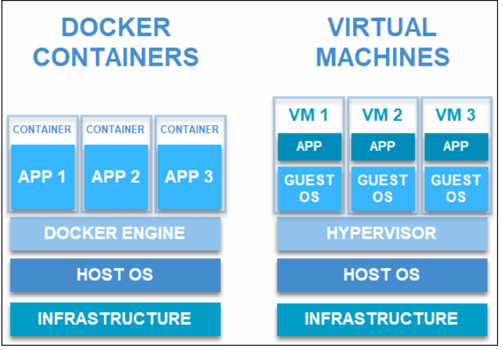
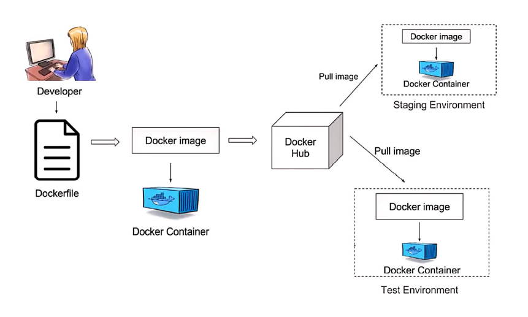

# Compte Rendu SAE 2.03  

**Équipe :** Équipe n°5  

**Nom des membres de l'équipe :**  

Andoche Keran,  

Dinh Tran Thai Duc,  

Claccin Noemie,  

Rocha Anthony  

**Année :** 2021/2022   

**Département Informatique , IUT Le Havre - Sae2.03**

--------------------------------------------------------------------------------
--------------------------------------------------------------------------------

# 
 SOMMAIRE 

## I)   Présentation de Docker

## II)  Installation du serveur multimédia Jellyfin avec Docker

## III) Les problèmes survenus à l'installation

## IV) Les solutions apportées à ces problèmes d'installation

## Conclusion

-------------------------------------------------------------------------------- 
-------------------------------------------------------------------------------- 

## I) Présentation de Docker

#### Qu'est-ce qu'un container ?

Tout d'abord, il est nécessaire de définir un container avant Docker. Un container Docker est un environnement d’exécution virtualisé dans lequel les utilisateurs peuvent isoler les applications du système sous-jacent. Ces conteneurs sont des unités compactes et portables dans lesquelles on peut démarrer une application rapidement et facilement.  
      
Il ne faut pas le confondre avec une une image Docker qui est un fichier immuable  qui contient le code source, les bibliothèques, les dépendances, les outils et autres fichiers nécessaires à l’exécution d’une application.

Plus concrètement, un container est une image Docker en cours d'exécution. Il dépend d'une image pour pourvoir exister : 

#### Qu'est-ce que Docker ?  

Il s’agit d’une plateforme logicielle open source permettant de créer, de déployer et de gérer des containers d’applications virtualisées sur un système d’exploitation.  Les services ou fonctions de l’application et ses différentes bibliothèques, fichiers de configuration, dépendances et autres composants sont regroupés au sein du container.

#### Les avantages et inconvénients de l'utilisation de Docker

Par rapport aux machines virtuelles, Docker présente également plusieurs avantages. Elle permet de développer des applications de façon plus efficiente, en utilisant moins de ressources, et de déployer ces applications plus rapidement. En effet, les machines virtuelles utilisent du matériel informatique comme les hyperviseurs tandis que les containers partagent le même système d'exploitation. Par conséquent, les containers sont plus efficient en terme de consommation de ressources systèmes. 

Cependant, Docker possède également des inconvénients :  

Il est difficile de gérer de manière efficiente plusieurs containers à la fois.  
La sécurité est insuffisante : les containers sont isolés et partagent un même système d'exploitation.  

  

## II) Installation du serveur multimédia Jellyfin avec Docker

  

## III) Les problèmes survenus à l'installation

Durant l'installation du serveur Jellyfin, nous nous sommes exposés à diverses problèmes comme :  
  
Privilèges insuffisants pour l'installation  
La configuration de logicielle insuffisante  
Échec de l'ouverture d'un paquet d'installation

## IV) Les solutions apportées à ces problèmes d'installation

## Conclusion

