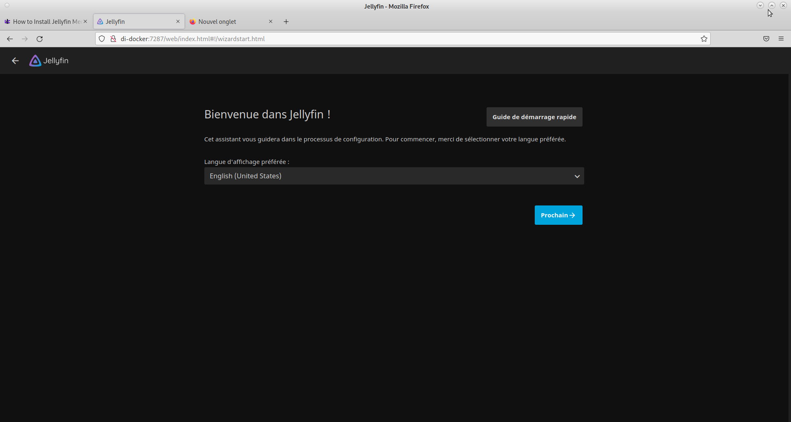

# Compte Rendu SAE 2.03  

**Équipe :** Équipe n°5  

**Nom des membres de l'équipe :**  

Andoche Keran,  

Dinh Tran Thai Duc,  

Claccin Noemie,  

Rocha Anthony  

**Année :** 2021/2022   

**Département Informatique , IUT Le Havre - Sae2.03**

--------------------------------------------------------------------------------

 [center]Texte[/center]

## I) Présentation de Docker

## II) Installation du serveur multimédia Jellyfin avec Docker

## III) Les problèmes survenus à l'installation

## IV) Les soultions apportées à ces problèmes d'installation

## Conclusion

--------------------------------------------------------------------------------  

## I) Présentation de Docker

## II) Installation du serveur multimédia Jellyfin avec Docker

## III) Les problèmes survenus à l'installation

## IV) Les soultions apportées à ces problèmes d'installation

## Conclusion

